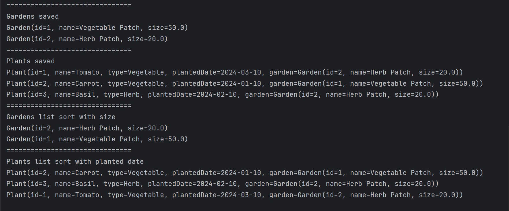

# vms (vegatable management system)

#Requrements
1.  Make garden with vegetables
2.  Add vegetables plant to garden
3.  Remove vegetables plant from garden
4.  Update vegetables plant in garden
5.  View vegetables plant in garden one by one
6.  view all vegetables plant in garden
7.  display all garden order 
8.  display all plants

# image of Er diagram

# image CONSOLE

